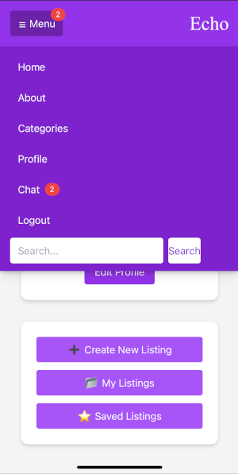
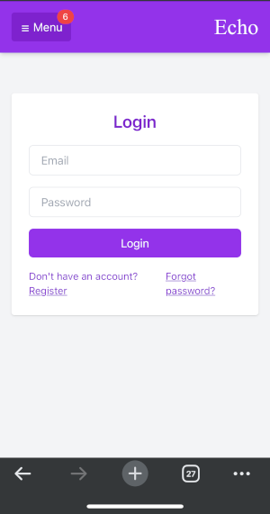
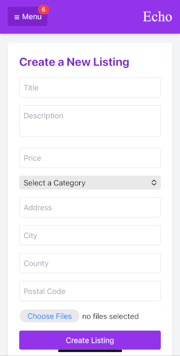
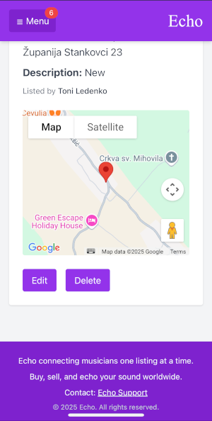

# Echo – A Marketplace for Instruments and Music Equipment

**Echo** is a full-stack web application built to connect musicians through a community-driven marketplace. Whether you're selling gear or scouting instruments — Echo makes it simple, sleek, and social.

## Features

- **User Authentication** (Register, Login, Logout, Profile Update)
- **Listings** (Create, Update, Delete, Browse, Save)
- **Real-time Chat** between buyers and sellers
- **Integrated Google Maps** to display listing locations
- **Category Filtering** & Search functionality
- **Image Uploads** with preview + gallery support
- **Responsive UI** (Mobile, Tablet, Desktop)


## Tech Stack

| Frontend             | Backend               |
|----------------------|---------------------- |
| React + Vite         | Django REST Framework |
| TailwindCSS          | JWT Authentication    |
| React Router DOM     | PostgreSQL (or SQLite)|
| WebSocket (WS)       | Django Channels       |
| Google Maps API      | Cloudinary for images |

## Getting Started

### 1. Clone the repository:

```bash
git clone https://github.com/AnteLedenko/Echo.git
cd Echo
```

### 2. Frontend Setup

```bash
cd frontend
npm install
npm run dev
```

### 3. Backend Setup

```bash
cd backend
python -m venv venv
source venv/bin/activate
pip install -r requirements.txt
python manage.py migrate
python manage.py runserver
```

### Navigation

Form that allows users to create new listings with multiple images, category selection, and location details.

### Home

Displays the latest listings from all users. Responsive card layout with save and view buttons.

### Login

Simple and secure login form using JWT authentication. Redirects users to their profile upon login.

### Create Listing Form

Form that allows users to create new listings with multiple images, category selection, and location details.

### Listing Detail

Shows full listing details, image carousel, map preview, and actions like saving, messaging, editing, or deleting.

### Google Maps

Interactive map showing the listing's location, powered by Google Maps API.

### Chat List

Displays all active conversations. Each chat item includes user info, last message, and unread message badge.

### Chat Interface

Real-time messaging between users. Chat bubbles show message ownership, time, and read receipts.